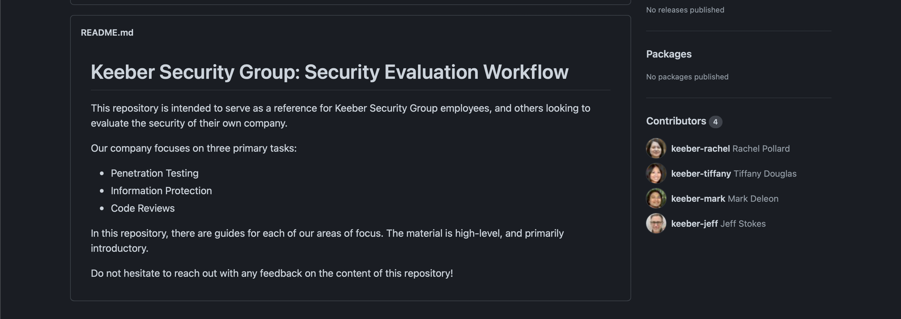
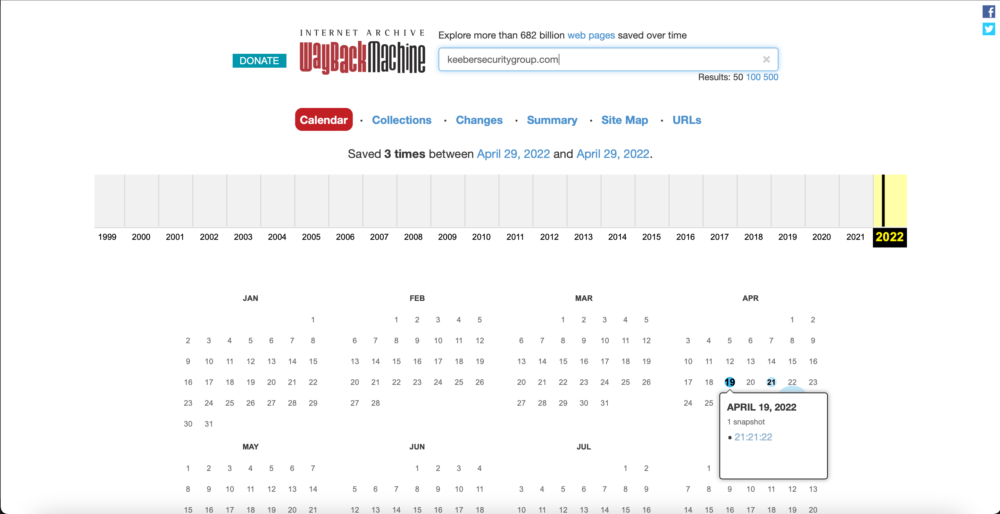
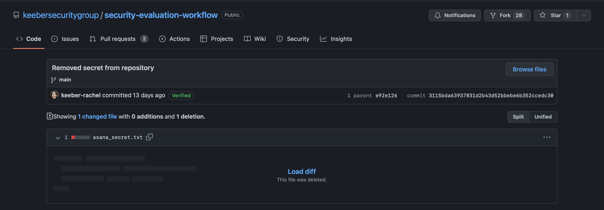
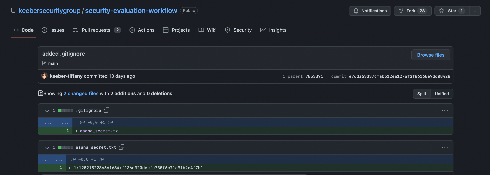

# Keeber
### Challenge Group | medium | OSINT | 1842 points
<br />

[Keeber 1](#keeber-1)
[Keeber 2](#keeber-2)
[Keeber 3](#keeber-3)
[Keeber 4](#keeber-4)
[Keeber 5](#keeber-5)
[Keeber 6](#keeber-6)
[Keeber 7](#keeber-7)
[Keeber 8](#keeber-8)

## Keeber 1 | 50 pts
### Description
You have been applying to entry-level cybersecurity jobs focused on reconnaissance and open source intelligence (OSINT). Great news! You got an interview with a small cybersecurity company; the Keeber Security Group. Before interviewing, they want to test your skills through a series of challenges oriented around investigating the Keeber Security Group.

The first step in your investigation is to find more information about the company itself. All we know is that the company is named Keeber Security Group and they are a cybersecurity startup. To start, help us find the person who registered their domain. The flag is in regular format.
<br /> <br />

### Solution
Searching `Keeber Security Group` on Google brings up their website - [keebersecuritygroup.com](keebersecuritygroup.com)


The first thing that comes to mind is `whois`, a command line tool that provides information about a particular domain.

```bash
$ whois keebersecuritygroup.com
    Domain Name: KEEBERSECURITYGROUP.COM
    Registry Domain ID: 2689392646_DOMAIN_COM-VRSN
    Registrar WHOIS Server: whois.name.com
    Registrar URL: http://www.name.com
    Updated Date: 2022-04-15T01:52:49Z
	...
	Registry Registrant ID: Not Available From Registry 
	Registrant Name: flag{ef67b2243b195eba43c7dc797b75d75b} Redacted 
	Registrant Organization:  
	Registrant Street: 8 Apple Lane  
	Registrant City: Standish 
	Registrant State/Province: ME 
	Registrant Postal Code: 04084 
	Registrant Country: US 
```
A lot of information shows up, however after a bit of scrolling, you find the flag in the Registrant Name field.

Flag: `flag{ef67b2243b195eba43c7dc797b75d75b}`
<br /> <br />

## Keeber 2 | 50 pts
### Description
The Keeber Security Group is a new startup in its infant stages. The team is always changing and some people have left the company. The Keeber Security Group has been quick with changing their website to reflect these changes, but there must be some way to find ex-employees. Find an ex-employee through the group's website. The flag is in regular format.
<br /> <br />

### Solution
The challenge in reality has just one step, however I ended up taking a longer route due to not taking the challenge description seriously :P

The current Team page on their website lists 6 employees:


Their website also has a link to their GitHub, and so previous commits would have the flag right? Nope :/


However, searching their GitHub repositories did reveal something. In one of their repos, [security-evaluation-workflow](https://github.com/keebersecuritygroup/security-evaluation-workflow), the contributors list mentioned a name that was not in the list of employees at the website - Tiffany Douglas.


So this has to be the ex-employee we have to find, but still no flag :/ I actually went further ahead in this rabbit hole, most of which is the solution for another Keeber challenge (the story continues in [#keeber-4](#keeber-4)). After all that and still no flag, I reached out for help, and this one line alone from an admin made the solution crystal clear:
> There are ways beyond github to look at a websites history

WAYBACK MACHINE!!! The description clearly said "Find an ex-employee through the group's **website.**" So searching the GitHub had nothing to do with this challenge, oh well. At least it proved helpful for the upcoming challenges.

Searching for the domain on Wayback Machine shows snapshots from three separate dates, I clicked on the oldest one, which the April 19th screenshot.


Clicking on the Team page and scrolling below shows Tiffany Douglas' name, and below it, the flag!


Flag: `flag{cddb59d78a6d50905340a62852e315c9}`
<br /> <br />

## Keeber 3 | 50 pts
### Description
The ex-employee you found was fired for "committing a secret to public github repositories". Find the committed secret, and use that to find confidential company information. The flag is in regular format.
<br /> <br />

### Solution
The searching through GitHub in the previous challenges definitely wasn't all gone to waste, as I ended up getting the flag for this challenge a lot faster. In the commits of the security-evaluation-workflow repo, one commit reads `Removed secret from repository`. 


From the file name, we know its the secret token to Asana, that helps companies track and manage their work. So now we need to find the commit in which the secret was added. It is added in just a few commits prior - `added .gitignore`. Quick intro to .gitignore: A gitignore file specifies intentionally untracked files that Git should ignore. This includes files that contain confidential information, like passwords and secret keys.


Oh, it was a spelling mistake in `.gitignore` that led to this, yikes. Moving on, to find out how I can use this secret key to get the flag, off to Google! This brings up to Asana's documentation about [Personal Access Tokens](https://developers.asana.com/docs/personal-access-token):


Using the example cURL request on the right, I could get the flag, replacing the ACCESS_TOKEN field with the secret we found from the repo:

```bash
$ curl https://app.asana.com/api/1.0/users/me \
>   -H "Authorization: Bearer 1/1202152286661684:f136d320deefe730f6c71a91b2e4f7b1"
{"data":{"gid":"1202152286661684","email":"keebersecuritygroup@protonmail.com","name":"flag{49305a2a9dcc503cb2b1fdeef8a7ac04}","photo":null,"resource_type":"user","workspaces":[{"gid":"1202152372710256","name":"IT","resource_type":"workspace"},{"gid":"1146735861536945","name":"My Company","resource_type":"workspace"},{"gid":"1202202099837958","name":"Marketing","resource_type":"workspace"},{"gid":"1202201989074836","name":"Informatique","resource_type":"workspace"},{"gid":"1202203933473664","name":"Engineering","resource_type":"workspace"},{"gid":"1202205585474112","name":"Design","resource_type":"workspace"},{"gid":"1202206423101119","name":"IT","resource_type":"workspace"},{"gid":"1202166412558403","name":"richdn.com","resource_type":"workspace"},{"gid":"1202206546743807","name":"IT","resource_type":"workspace"}]}}
```

Flag: `flag{49305a2a9dcc503cb2b1fdeef8a7ac04}`
<br /> <br />

## Keeber 4 | 318 pts
### Description
The ex-employee also left the company password database exposed to the public through GitHub. Since the password is shared throughout the company, it must be easy for employees to remember. The password used to encrypt the database is a single lowercase word somehow relating to the company. Make a custom word list using the Keeber Security Groups public facing information, and use it to open the password database The flag is in regular format.

(Hint: John the Ripper may have support for cracking .kdbx password hashes!)
<br /> <br />

### Solution
<br /> <br />

## Keeber 5 | 50 pts
### Description
The ex-employee in focus made other mistakes while using the company's GitHub. All employees were supposed to commit code using the keeber-@protonmail.com email assigned to them. They made some commits without following this practice. Find the personal email of this employee through GitHub. The flag is in regular format.
<br /> <br />

### Solution
<br /> <br />

## Keeber 6 | 368 pts
### Description
After all of the damage the ex-employee's mistakes caused to the company, the Keeber Security Group is suing them for negligence! In order to file a proper lawsuit, we need to know where they are so someone can go and serve them. Can you find the ex-employee’s new workplace? The flag is in regular format, and can be found in a recent yelp review of their new workplace.

(Hint: You will need to pivot off of the email found in the past challenge!)
<br /> <br />

### Solution
<br /> <br />

## Keeber 7 | 474 pts
### Description
Multiple employees have gotten strange phishing emails from the same phishing scheme. Use the email corresponding to the phishing email to find the true identity of the scammer. The flag is in regular format.

(Note: This challenge can be solved without paying for anything!)
<br /> <br />

### Solution
<br /> <br />

## Keeber 8 | 482 pts
### Description
Despite all of the time we spend teaching people about phishing, someone at Keeber fell for one! Maria responded to the email and sent some of her personal information. Pivot off of what you found in the previous challenge to find where Maria's personal information was posted. The flag is in regular format.
<br /> <br />

### Solution
<br /> <br />
